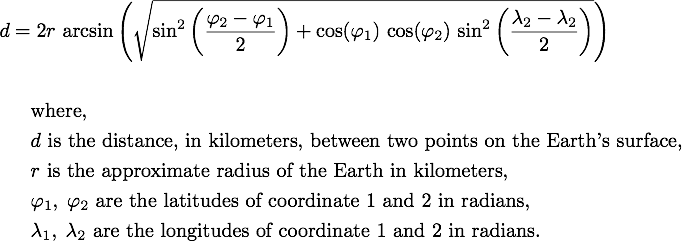

# Measuring distance between latitude and longitude coordinates

Throughout this analysis, the **haversine formula**, which measures great-circle distance between two points on a sphere given their latitudes and longitudes, is used to convert the distances between coordinates.

## Haversine formula

The formula, as outlined on Wikipedia (see Source 1 below), can be represented as:

<br>



<br>

## Vectorized python haversine implementation

Below is the specific python implementation used throughout this analysis.

Please note that methods used in this function require the Numpy python library to be imported with `import numpy as np`. No other libraries are required.

This implementation is adapted from a similar implementation found on Stack Overflow (see Source 2 below)

```py
def distance(locs1, locs2, r=3958.75, meters=True):
    """
    Converts distances between lat/lon points to meters using the Haversine
    formula for measuring distance on a sphere

    If the desire is to measure pairwise distances between two coordinate
    arrays of equal length, or between two single sets of coordinates, this
    function can simply be called as `distance(locs1, locs2)`

    If the desire is to measure the distances of each coordinate in array 1
    all coordinates in array 2, the function needs to be called in this
    manner `distance(locs1[:, None], locs2)`
    
    locs1: np.array or list of lat/lon points
    locs2: np.array or list of lat/lon points
    r: float, default=3958.75, great sphere approximated radius of the earth
       in kilometers
    meters: boolean, default=True, specifies the output
            units of the distances returned by this function, meters if True,
            and kilometers if False
    
    returns: np.array of the distances between 
    """
    if meters:
        r = r * 1000
    # convert lat/lon coordinates to radians
    locs1 = locs1 * np.pi / 180
    locs2 = locs2 * np.pi / 180
    
    cos_lat1 = np.cos(locs1[..., 0])
    cos_lat2 = np.cos(locs2[..., 0])
    
    cos_lat_d = np.cos(locs1[..., 0] - locs2[..., 0])
    cos_lon_d = np.cos(locs1[..., 1] - locs2[..., 1])
    
    return r * np.arccos(cos_lat_d - cos_lat1 * cos_lat2 * (1 - cos_lon_d))
```

**Sources:**

1. Wikipedia, Haversine formula, https://en.wikipedia.org/wiki/Haversine_formula
2. Stack Overflow, Efficient way to calculate distance matrix given latitude and longitude data in Python, https://stackoverflow.com/a/19414306